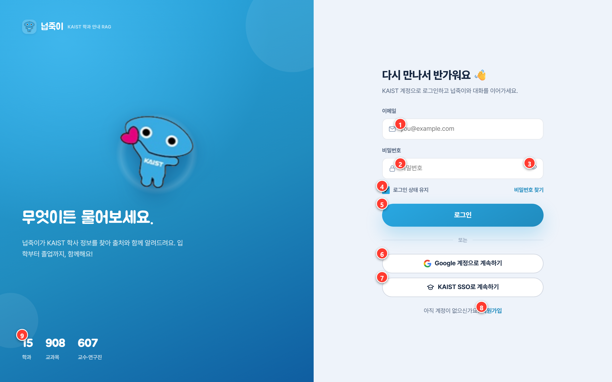
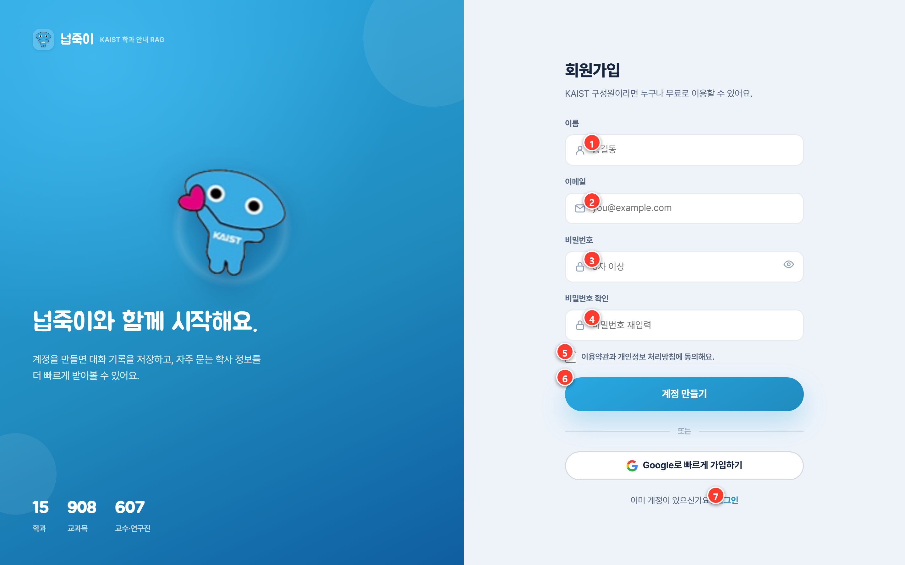
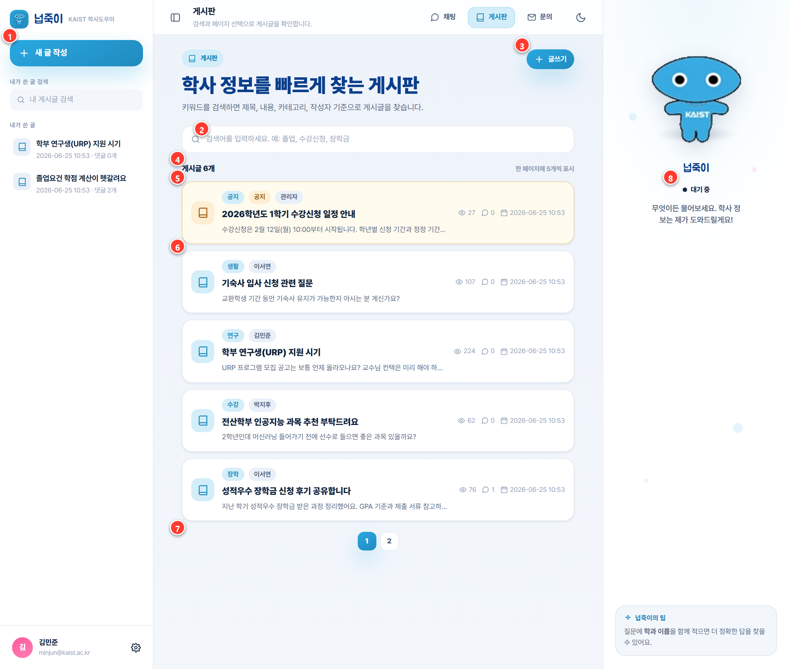
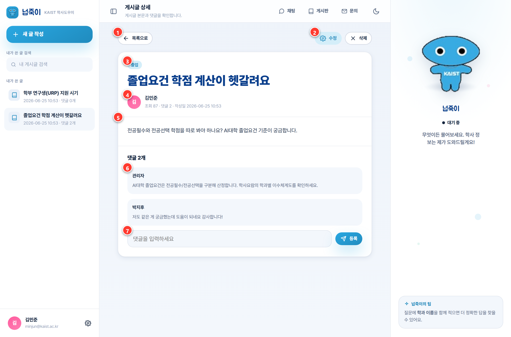
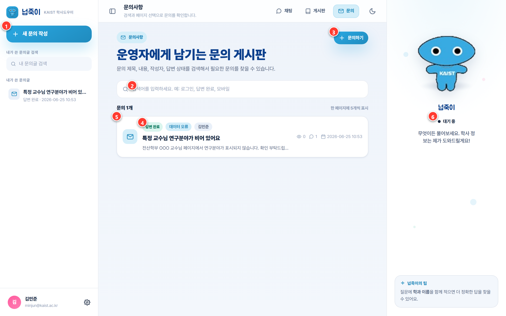
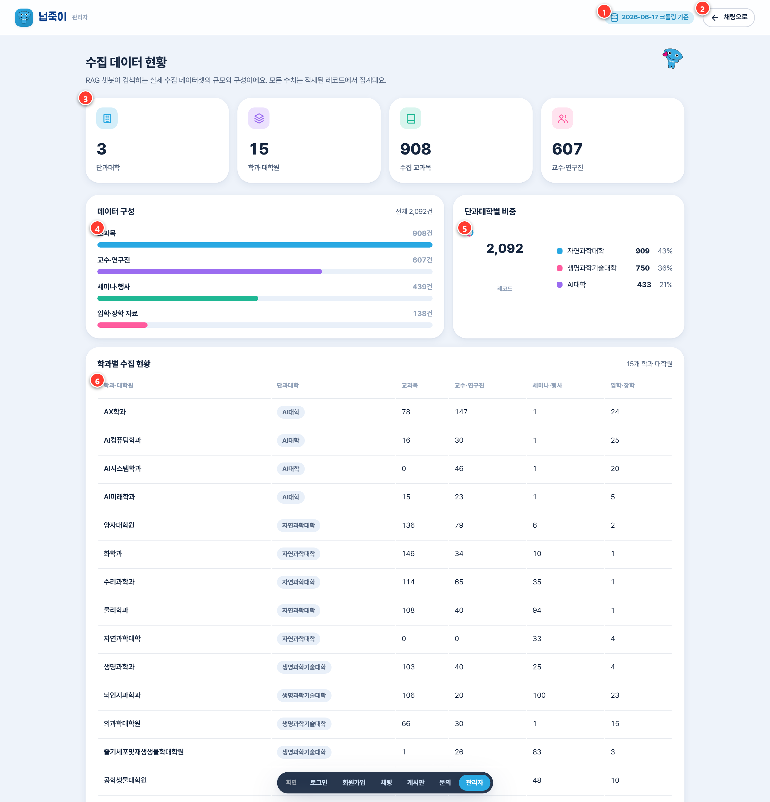

<div align="center">

# 🐢 넙죽이 — KAIST AI 학과 안내 RAG 챗봇

**흩어진 KAIST AI 학과 정보를, 출처와 함께 대화로 답하는 웹 애플리케이션**

[](https://www.python.org/)
[](https://www.djangoproject.com/)
[](https://developer.mozilla.org/)
[](https://www.langchain.com/)
[](https://platform.openai.com/)
[](https://www.trychroma.com/)
[](https://www.mysql.com/)

SKN28 4기 · 2팀 · 4차 프로젝트 · 발표일 2026-06-26

</div>

---

## 📑 목차

1. [프로젝트 소개](#1-프로젝트-소개)
2. [팀 소개](#2-팀-소개)
3. [기술 스택](#3-기술-스택)
4. [요구사항 정의서](#4-요구사항-정의서)
5. [화면설계서](#5-화면설계서)
6. [주요 기능](#6-주요-기능)
7. [테스트 계획 및 결과](#7-테스트-계획-및-결과)
8. [로컬 실행 방법](#8-로컬-실행-방법)
9. [프로젝트 산출물](#9-프로젝트-산출물)
10. [한 줄 회고](#10-한-줄-회고)

---

## 1. 프로젝트 소개

> KAIST AI 관련 학과(AI컴퓨팅학과 · AI시스템학과 · AX학과 · AI미래학과)의 입학·교과목·교수진·사무실 정보는 여러 공식 페이지와 PDF에 흩어져 있어 한 번에 찾기 어렵습니다.

**넙죽이**는 흩어진 내·외부 문서를 수집·전처리하여 **SQL(정형) + Vector(비정형) 하이브리드 검색**과 **LLM RAG 파이프라인**으로 연동하고, 사용자의 자연어 질문에 **근거(출처)와 함께** 답변하는 웹 애플리케이션입니다. 단순 질의응답을 넘어 **대화 기록·답변 피드백·운영 통계·보완 Q&A 게시판**까지 서비스 운영 관점의 기능을 제공합니다.

**핵심 가치**
- 🔎 **출처 기반 답변** — 모든 답변에 학과·문서·URL 출처 카드를 함께 제시
- 🧭 **하이브리드 검색** — 구조화 데이터(MySQL)와 의미 검색(Chroma)을 결합
- 💬 **대화형 경험** — 마스코트 '넙죽이'와 세션 기반 대화, 답변 피드백
- 🗂️ **운영 기능** — 게시판/문의, 답변 상태 관리, 수집 데이터 통계 대시보드

---

## 2. 팀 소개

| <div align="center">김성재</div> | <div align="center">손지은</div> | <div align="center">신혜지</div> | <div align="center">심기성</div> |
|:---:|:---:|:---:|:---:|
| [@hippo2coding](https://github.com/hippo2coding) | [@yjson616](https://github.com/yjson616) | [@HyejiShin-20](https://github.com/HyejiShin-20) | [@sim2084](https://github.com/sim2084) |
|  |  |  |  |

---

## 3. 기술 스택

| 분류 | 기술 |
|---|---|
| **Frontend** |    |
| **Backend** |   |
| **AI / RAG** |    |
| **Database** |   |
| **Data** |   |
| **Tooling** |    |

---

## 4. 요구사항 정의서

전체 명세는 **[docs/요구사항정의서.md](docs/요구사항정의서.md)** (+ PDF). 핵심 요구사항 요약:

| 구분 | ID | 요구사항 | 유형 |
|---|---|---|---|
| 인증 | AUTH | 회원가입·로그인·로그아웃, 세션 기반 인증 | 기능 |
| 채팅 | CHAT | 자연어 질문 → 출처 포함 RAG 답변, 대화 세션·기록 | 기능 |
| 검색 | RAG | SQL(정형)+Vector(비정형) 하이브리드 검색, 범위 밖/되묻기 처리 | 기능 |
| 피드백 | FB | 답변 👍/👎 피드백, 실패 질문 로그 | 기능 |
| 커뮤니티 | COMM | 보완 Q&A 게시판·문의, 댓글, 공지/비공개/차단 | 기능 |
| 운영 | ADMIN | 수집 데이터 통계 대시보드, 문의 답변 상태 관리 | 기능 |
| 비기능 | NFR | 응답 안정성, 입력 검증, 보안(CSRF·세션), 로컬·클라우드 실행 | 비기능 |

---

## 5. 화면설계서

실제 화면에 번호 마커(①②③)를 표기하고, 번호별 화면 요소·동작을 설명합니다. 화면별 상세 설계는 `docs/frontend_wireframes_*.md` 참고.

### 5.1 로그인



| 번호 | 요소 | 설명 |
|:--:|---|---|
| ① | 이메일 입력 | 이메일 형식을 검증해 잘못된 형식이면 안내 메시지를 표시 |
| ② | 비밀번호 입력 | 6자 이상 입력, 미충족 시 오류 표시 |
| ③ | 비밀번호 표시 토글 | 눈 아이콘 클릭으로 입력값을 보이거나 숨김 |
| ④ | 로그인 상태 유지 | 기본 체크 상태, 로그인 세션을 유지 |
| ⑤ | 로그인 버튼 | 검증 통과 시 로그인하고 채팅 화면으로 이동 |
| ⑥ | Google 계정 로그인 | 시연용 버튼 (OAuth 미연동) |
| ⑦ | KAIST SSO 로그인 | 시연용 버튼 (OAuth 미연동) |
| ⑧ | 회원가입 링크 | 회원가입 화면으로 전환 |
| ⑨ | 실데이터 통계 | 학과·교과목·교수 수를 수집 데이터에서 실시간 집계해 표시 |

상세: [login_signup](docs/frontend_wireframes_login_signup.md)

### 5.2 회원가입



| 번호 | 요소 | 설명 |
|:--:|---|---|
| ① | 이름 입력 | 필수 입력 |
| ② | 이메일 입력 | 형식 검증 + 서버에서 가입 이메일 중복 검사 |
| ③ | 비밀번호 | 6자 이상 (서버 비밀번호 정책 동일) |
| ④ | 비밀번호 확인 | 위 비밀번호와 일치해야 통과 |
| ⑤ | 약관 동의 | 필수 체크, 미동의 시 가입 차단 |
| ⑥ | 계정 만들기 | 가입 성공 시 자동 로그인 후 채팅으로 이동 |
| ⑦ | 로그인 링크 | 로그인 화면으로 전환 |

### 5.3 채팅 (메인 기능)


| 번호 | 요소 | 설명 |
|:--:|---|---|
| ① | 새 대화 시작 | 현재 세션을 해제하고 웰컴 화면으로 초기화 |
| ② | 대화 검색 | 세션 제목으로 대화 목록을 필터 |
| ③ | 세션 목록 | 날짜별로 묶인 대화, 클릭하면 해당 대화 기록을 불러옴 |
| ④ | 사용자 카드 / 로그아웃 | 로그인 사용자 정보, 클릭 시 로그아웃 |
| ⑤ | 대화 제목·부제 | 현재 세션 제목과 안내 범위(AI대학·자연과학·생명과학기술대) |
| ⑥ | 사용자 질문 | 사용자가 입력한 질문 말풍선 |
| ⑦ | 넙죽이 답변 | LLM이 생성한 답변(마크다운을 안전 HTML로 렌더) |
| ⑧ | 출처 카드 | 답변 근거를 학과·문서·점수로 제시, 클릭 시 원문을 새 탭으로 |
| ⑨ | 피드백 | 👍/👎 평가, 답변 복사, 다시 생성 |
| ⑩ | 입력창 | `Enter` 전송 / `Shift+Enter` 줄바꿈, 높이 자동 확장 |
| ⑪ | 전송 버튼 | 빈 입력이거나 응답 중에는 비활성 |
| ⑫ | 마스코트 상태칩 | 대기 → 생각중 → 검색 → 완료(예외 시 경고) 상태를 시각화 |

상세: [chat_main](docs/frontend_wireframes_chat_main.md)

### 5.4 게시판 — 목록



| 번호 | 요소 | 설명 |
|:--:|---|---|
| ① | 새 글 작성(레일) | 글쓰기 화면으로 진입 (비로그인 시 로그인 유도) |
| ② | 검색창 | 제목·내용·카테고리·작성자 기준 부분일치 검색 |
| ③ | 글쓰기 버튼 | 글 작성 화면으로 진입 |
| ④ | 게시글 수 | 총 건수 표시, 한 페이지에 5개씩 |
| ⑤ | 공지 글 | 관리자 공지는 상단에 고정되고 뱃지로 구분 |
| ⑥ | 게시글 행 | 카테고리·작성자·제목·요약·조회/댓글 수 |
| ⑦ | 페이지네이션 | 5개 단위로 페이지 이동 |
| ⑧ | 넙죽이 패널 | 마스코트 상태칩·팁 (커뮤니티 공통) |

### 5.5 게시판 — 게시글 상세



| 번호 | 요소 | 설명 |
|:--:|---|---|
| ① | 목록으로 | 게시판 목록으로 복귀 |
| ② | 수정 / 삭제 | 글 작성자 본인에게만 노출 |
| ③ | 카테고리·공지 뱃지 | 글 분류 및 공지/댓글차단 상태 표시 |
| ④ | 작성자 카드 | 작성자·조회수·댓글 수·작성일 |
| ⑤ | 본문 | 글 내용, 참고 링크가 있으면 새 탭 링크로 표시 |
| ⑥ | 댓글 / 대댓글 | 작성자명 + 내용, 본인 댓글은 수정/삭제 가능 |
| ⑦ | 댓글 입력창 | 로그인 시 작성, 게스트·댓글차단 글은 비활성 |

상세: [board](docs/frontend_wireframes_board.md)

### 5.6 문의



| 번호 | 요소 | 설명 |
|:--:|---|---|
| ① | 새 문의 작성 | 문의 작성 화면으로 진입 |
| ② | 검색창 | 제목·내용·작성자·답변 상태로 검색 |
| ③ | 문의하기 버튼 | 문의 작성 화면으로 진입 |
| ④ | 답변 상태칩 | 답변 대기 / 처리중 / 답변 완료를 색으로 구분 |
| ⑤ | 문의 행 | 유형·작성자·제목, 비공개 문의는 🔒 표시(작성자·관리자만 열람) |
| ⑥ | 넙죽이 패널 | 마스코트 상태칩·팁 (커뮤니티 공통) |

상세: [inquiry](docs/frontend_wireframes_inquiry.md)

### 5.7 관리자 — 수집 데이터 현황



| 번호 | 요소 | 설명 |
|:--:|---|---|
| ① | 크롤링 기준 뱃지 | 데이터 수집 기준일 표기 |
| ② | 채팅으로 | 채팅 화면으로 복귀 |
| ③ | KPI 카드 | 단과대학·학과·교과목·교수 수를 실데이터에서 집계 |
| ④ | 데이터 구성(막대) | 교과목·교수·세미나·입학 등 레코드 유형별 건수 |
| ⑤ | 단과대학별 비중(도넛) | 단과대학별 총 레코드 비중(%) |
| ⑥ | 학과별 수집 현황 표 | 학과 단위로 교과목·교수·세미나·입학을 합산 |

상세: [admin_dashboard](docs/frontend_wireframes_admin_dashboard.md)

---

## 6. 주요 기능

| 기능 | 설명 |
|---|---|
| 🔐 **인증** | 회원가입·로그인·로그아웃, 세션/CSRF 보안, 본인 글 관리 권한 |
| 💬 **RAG 채팅** | 질문→하이브리드 검색→출처 포함 답변, 세션별 대화 기록, 되묻기(clarify)/범위밖(blocked) 처리 |
| 📚 **출처 카드** | 답변 근거를 학과·문서명·URL로 제시, 클릭 시 원문 이동 |
| 📝 **게시판** | 학사 보완 Q&A — 카테고리·검색·공지·댓글, 작성자/관리자 권한 |
| 📨 **문의** | 운영자 문의 — 유형·비공개·답변 상태(대기/처리중/완료) |
| 📊 **관리자 통계** | 수집 데이터 현황(단과대학·학과·교과목·교수), 차트·학과별 표 |

---

## 7. 테스트 계획 및 결과

로컬 실행 환경(Django + MySQL `kaist_ai`)에서 핵심 기능을 End-to-End로 검증했습니다.

**요약**

| 총 항목 | ✅ Pass | ❌ Fail | 비고 |
|:---:|:---:|:---:|---|
| 9 | 9 | 0 | 정상 흐름 + 예외 처리 검증 |

**상세 결과**

| ID | 항목 | 방법 | 기대 결과 | 결과 |
|---|---|---|---|---|
| T-01 | 페이지 라우트 | `/login` `/signup` `/chat` `/board` `/inquiry` `/admin-stats` 응답 | 200(관리자 302 리다이렉트) | ✅ |
| T-02 | 정적 자산 | community.css·js, app.js, chat.js 로드 | 200 | ✅ |
| T-03 | 회원가입 | `POST /api/auth/signup` | 201 + 세션 로그인 | ✅ |
| T-04 | 로그인 상태 | `GET /api/auth/me` | `authenticated: true` | ✅ |
| T-05 | 게시글 작성 | `POST /api/community/posts` (CSRF) | 201, DB 저장 | ✅ |
| T-06 | 목록 반영 | `GET /api/community/posts` | 작성 글 count 반영 | ✅ |
| T-07 | DB 연동 | MySQL `kaist_ai` 마이그레이션·조회 | 22개 수집 테이블 + 앱 테이블 | ✅ |
| T-08 | 예외 — 빈 입력 | 카테고리/제목/본문 누락 | 400 + 안내 메시지 | ✅ |
| T-09 | 예외 — RAG 불가 | 엔진/키 미구성 시 채팅 | FALLBACK 안내(서버 무중단) | ✅ |

> 발견/개선: ① OAuth(Google·KAIST SSO)는 시연용 버튼으로 미동작 — 실연동 예정. ② Chroma 벡터 인덱스 미구축 시 채팅은 폴백 응답 — 인덱스 빌드 후 정식 답변. (상세 빌드: `scripts/data/build_vectorstore.py`)

---

## 8. 로컬 실행 방법

> 요구: Python 3.12, MySQL 8.x, (선택) OpenAI API 키

```bash
# 1) 가상환경 + 의존성
uv venv && uv pip install -r requirements.txt

# 2) 환경변수 — .env 작성
#   KAIST_MYSQL_USER / KAIST_MYSQL_PASSWORD / KAIST_MYSQL_DATABASE=kaist_ai
#   OPENAI_API_KEY=sk-...
#   (MySQL 없이 빠르게: DJANGO_USE_SQLITE=true)

# 3) DB 마이그레이션
python manage.py migrate

# 4) 서버 실행
python manage.py runserver 127.0.0.1:8000
```

브라우저에서 **http://127.0.0.1:8000/login/** 접속.
데이터 적재(크롤링 데이터 → MySQL)는 **[docs/sql_README.md](docs/sql_README.md)** / `scripts/sql/` 참고.

---

## 9. 프로젝트 산출물

| 산출물 | 위치 |
|---|---|
| 요구사항 정의서 | [docs/요구사항정의서.md](docs/요구사항정의서.md) · PDF |
| 화면설계서 | [docs/frontend_wireframes_*.md](docs/) + `docs/images/screens/` |
| ERD | [docs/sql_ERD.md](docs/sql_ERD.md) |
| LLM 연동 웹 앱 | `src/kaist_rag/` (Django + RAG) |
| 데이터 적재 가이드 | [docs/sql_README.md](docs/sql_README.md) |

---

## 10. 한 줄 회고

| 팀원 | 회고 |
|---|---|
| **김성재** | RAG와 친해지며 성장할 수 있는 유의미한 시간을 가져서 좋았습니다. |
| **손지은** | 저는 오늘로 교육을 마무리하게 되었습니다. 그동안 감사했습니다. |
| **신혜지** | 백엔드 구조와 전체적인 흐름을 다뤄볼 수 있어서 좋았습니다. |
| **심기성** | 두 프로젝트를 연달아 진행하니 프로그램의 퀄리티가 확실히 올라가는 것이 보였습니다. 다만 새로 배운 내용을 바로 적용하려다 보니 작은 디테일들을 놓치게 되어 아쉬움도 있었습니다. 특히 배포를 위한 프론트엔드와 서버는 완전히 처음이라 더 공부가 필요할 것 같습니다. 그래도 협업으로 기획부터 배포까지의 과정을 경험한 것이 의미 있는 프로젝트였습니다. |

<div align="center">

**SKN28 4기 2팀** · 김성재 · 손지은 · 신혜지 · 심기성

</div>
