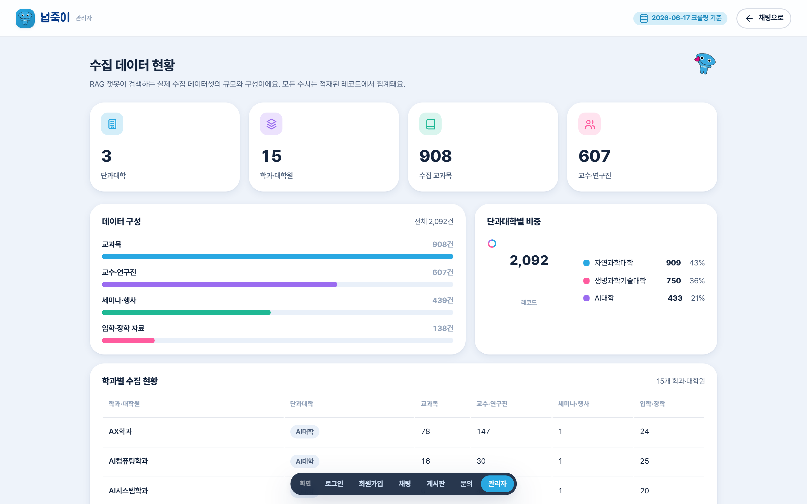

# 화면설계서 — 관리자 (수집 데이터 현황)

> RAG 챗봇이 검색하는 수집 데이터셋의 규모·구성을 한눈에 보는 관리자 대시보드. 모든 수치는 실제 적재 레코드에서 집계.

| 항목 | 내용 |
|---|---|
| 라우트 | `/admin-stats/` (관리자 전용) |
| 진입 | 채팅 헤더의 `관리자` 버튼(`role==='admin'`) |
| 화면 구성 | KPI 카드 · 데이터 구성(막대) · 단과대학 비중(도넛) · 학과별 표 |
| 데이터 출처 | `window.KB_DATA` 클라이언트 집계 (가짜 통계 없음) |

---

## 1. 실제 구현 화면

---

## 2. 화면 레이아웃 (와이어프레임)

    +-----------------------------------------------------------+
    |  넙죽이 관리자        [2026-06-17 크롤링 기준][채팅으로]    |
    |  수집 데이터 현황                                          |
    |  [단과대학 3][학과·대학원 15][교과목 908][교수·연구진 607] |
    |  +------------------------+   +------------------------+   |
    |  | 데이터 구성 (막대)     |   | 단과대학별 비중 (도넛) |   |
    |  |  교과목/교수/세미나/입학|   |  자연 909·생명 750·AI  |   |
    |  +------------------------+   +------------------------+   |
    |  | 학과별 수집 현황 (표)                              |   |
    |  |  학과·대학원 | 단과대학 | 교과목 | 교수 | 세미나 | 입학 |
    |  +---------------------------------------------------+   |
    +-----------------------------------------------------------+

---

## 3. 화면 구성 요소

| 영역 | 구성 요소 | 설명 |
|---|---|---|
| 헤더 | 브랜드(관리자) | "넙죽이 · 관리자" |
| 헤더 | 크롤링 기준 뱃지 | "2026-06-17 크롤링 기준" |
| 헤더 | `채팅으로` 버튼 | 채팅 화면 복귀 |
| KPI | 카드 4종 | 단과대학 · 학과·대학원 · 수집 교과목 · 교수·연구진 (천 단위 콤마) |
| 패널 1 | 데이터 구성(가로 막대) | 교과목 · 교수·연구진 · 세미나·행사 · 입학·장학 자료 (전체 N건, 진입 시 막대 애니메이션) |
| 패널 2 | 단과대학별 비중(도넛) | SVG 도넛 + 중앙 총 레코드 수 + 범례(학과명·건수·%) |
| 표 | 학과별 수집 현황 | 학과·대학원 / 단과대학 / 교과목 / 교수·연구진 / 세미나·행사 / 입학·장학 |

---

## 4. 집계 지표 정의

| 지표 | 계산 |
|---|---|
| 단과대학 | 수집 단과대학 수 |
| 학과·대학원 | 학과 마스터 수 |
| 수집 교과목 / 교수·연구진 | `KB_DATA.courses` / `.people` 레코드 수 |
| 데이터 구성(막대) | 레코드 유형별 건수, 최댓값 기준 비율로 막대 길이 |
| 단과대학 비중(도넛) | 단과대학별 총 레코드 비중(%) |
| 학과별 표 | 단과대학·교과목·교수·세미나·입학을 학과 단위로 합산·정렬 |

---

## 5. 상태 · 데이터 정책

| 상황 | 처리 |
|---|---|
| 진입 애니메이션 | 막대 그래프 width 0 → 실제 비율로 트랜지션 |
| 권한 | 관리자만 접근(비관리자는 메뉴·버튼 미노출) |
| 데이터 신뢰성 | **모든 수치는 적재된 실데이터 집계** — 임의 통계 없음 |

> 현재 통계는 정적 데이터셋(`kb_data.js`) 기준입니다. **운영 통계(질문 로그·미응답·답변 피드백)는 Django 백엔드 연동 시 확장**할 영역입니다.

---

## 6. 연동 (확장 예정)

| 구분 | 현재 | 확장 |
|---|---|---|
| 수집 데이터 통계 | 클라이언트 집계(`KB_DATA`) | 백엔드 집계 API |
| 운영 통계 | — | 질문 로그·미응답·피드백 집계(`/api/chat/*` 기반) |
