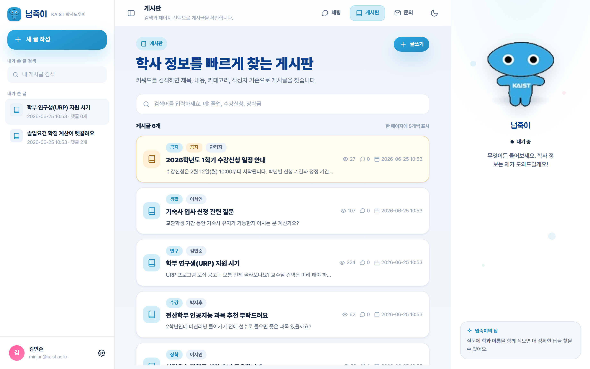
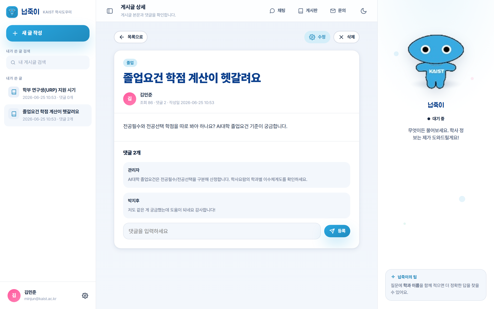

# 와이어프레임 — 게시판 (커뮤니티)

## 실제 구현 화면

| 게시판 목록 | 게시글 상세 |
|:---:|:---:|
|  |  |

## 레이아웃 (와이어프레임)

    +----------------+--------------------------------------+-------------------+
    | 좌측 레일      |  [게시판] 학사 정보를 빠르게 찾는 게시판 |  넙죽이 패널       |
    | [+ 새 글 작성] |  키워드로 제목·내용·카테고리·작성자 검색 |  (마스코트)        |
    | 내가 쓴 글 검색 |  [검색어... 예: 졸업, 수강신청, 장학금] |   상태칩           |
    | [내 게시글 검색]|--------------------------------------|   "무엇이든        |
    | 내가 쓴 글     |  게시글 N개        한 페이지에 5개 표시 |    물어보세요"     |
    |  · 글 제목 …   |  +--------------------------------+   |                   |
    |  · 글 제목 …   |  |[공지] 카테고리                 |   |   넙죽이의 팁     |
    | (로그인 필요)  |  | 제목 ........................  |   |                   |
    |                |  | 요약 한 줄 ..................  |   |  질문에 학과+이름  |
    |                |  | 작성자 · 작성일  조회n · 댓글n |   |  을 적으면 더      |
    |                |  +--------------------------------+   |  정확합니다.       |
    |                |  | (게시글) 카테고리 …            |   |                   |
    |                |  +--------------------------------+   |                   |
    |                |  [«  ‹  1  2  3  ›  »]  (페이지)      |                   |
    | [사용자/로그아웃]|  [+ 글쓰기]                          |                   |
    +----------------+--------------------------------------+-------------------+

    [글쓰기 모달]                         [글 상세 모달]
    +----------------------------+        +----------------------------+
    | 카테고리 ▼ (학사/수강/장학/ |        | [공지] 카테고리  제목        |
    |  졸업/연구/생활/자유)       |        | 작성자 · 작성일 · 조회 · 댓글 |
    | 제목 [................]    |        | 본문 ......................  |
    | 본문 [................]    |        | 참고 링크 → (새 탭)          |
    | 참고 URL [............]    |        | --- 댓글 N --------------    |
    | (관리자) □공지 □댓글차단    |        | 댓글/대댓글 · [답글][삭제]    |
    | [취소]            [등록]   |        | [댓글 입력...........][등록]  |
    +----------------------------+        | (작성자) [수정] [삭제]       |
                                          +----------------------------+

- 목록: 공지(notice)는 상단 고정·뱃지 표시, 일반 글은 최신순. 한 페이지 5개 + 페이지네이션.
- 카테고리: 학사 · 수강 · 장학 · 졸업 · 연구 · 생활 · 자유.
- 검색: 제목·내용·카테고리·작성자 기준 부분일치(디바운스 입력).
- 작성/댓글은 로그인 필요. 비로그인 시 좌측 "내가 쓴 글"에 "로그인 후 확인" 안내.
- 권한: 본인 글만 수정·삭제(canManage), 관리자(admin)는 공지 등록·댓글 차단·전체 관리.
- 댓글 차단(is_comment_blocked) 글은 댓글 입력 비활성 + 안내 문구.
- 예외: 빈 카테고리/제목/본문 → 인라인 오류, 로딩 중 스켈레톤, 실패 시 재시도 안내.
- API: `GET/POST /api/community/posts/`, `/posts/<id>/`, `/posts/<id>/comments/`, `/comments/<id>/`.
