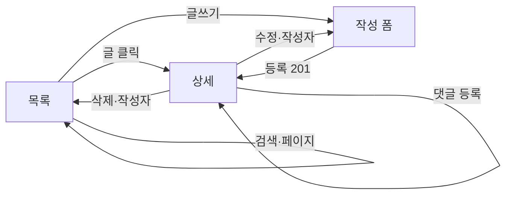

# 화면설계서 — 게시판 (커뮤니티)

> 학사 정보 공유·질의를 위한 보완 Q&A 게시판. 챗봇 답변을 보완하는 사용자 간 정보 교류 공간.

| 항목 | 내용 |
|---|---|
| 라우트 | `/board/` (SPA, `window.__ROUTE="board"`) |
| 화면 구성 | 목록 · 글 상세 · 글쓰기/수정 (단일 SPA 내 전환) |
| 접근 권한 | 열람: 누구나 / 작성·댓글: 로그인 / 공지·차단: 관리자 |
| 연동 API | `/api/community/posts/`, `/posts/<id>/`, `/posts/<id>/comments/`, `/comments/<id>/` |

---

## 1. 실제 구현 화면

| 게시판 목록 | 게시글 상세 |
|:---:|:---:|
|  |  |

---

## 2. 화면 레이아웃 (와이어프레임)

    +----------------+--------------------------------------+-------------------+
    | 좌측 레일      |  [게시판] 학사 정보를 빠르게 찾는 게시판 |  넙죽이 패널       |
    | [+ 새 글 작성] |  키워드로 제목·내용·카테고리·작성자 검색 |  (마스코트)        |
    | 내가 쓴 글 검색 |  [검색어... 예: 졸업, 수강신청, 장학금] |   상태칩           |
    | [내 게시글 검색]|--------------------------------------|   "무엇이든        |
    | 내가 쓴 글     |  게시글 N개        한 페이지에 5개 표시 |    물어보세요"     |
    |  · 글 제목 …   |  +--------------------------------+   |                   |
    |  · 글 제목 …   |  |[공지] 카테고리 작성자          |   |   넙죽이의 팁     |
    | (로그인 필요)  |  | 제목 ........................  |   |                   |
    |                |  | 요약 한 줄 ..................  |   |  질문에 학과+이름  |
    |                |  | 조회 n · 댓글 n · 작성일       |   |  을 적으면 더      |
    |                |  +--------------------------------+   |  정확합니다.       |
    |                |  | (게시글) 카테고리 …            |   |                   |
    |                |  +--------------------------------+   |                   |
    |                |  [«  ‹  1  2  3  ›  »]  (페이지)      |                   |
    | [사용자/로그아웃]|                                      |                   |
    +----------------+--------------------------------------+-------------------+

---

## 3. 화면 구성 요소

| 영역 | 구성 요소 | 설명 / 동작 |
|---|---|---|
| 좌측 레일 | `새 글 작성` 버튼 | 글쓰기 화면으로 전환 (비로그인 시 로그인 유도) |
| 좌측 레일 | `내 게시글 검색` | 내가 쓴 글 제목 필터 |
| 좌측 레일 | `내가 쓴 글` 목록 | 본인 작성 글 바로가기 (게스트: "로그인 후 확인할 수 있습니다") |
| 헤더 | 키커·제목·설명 | "게시판 / 학사 정보를 빠르게 찾는 게시판" |
| 툴바 | 검색창 | 제목·내용·카테고리·작성자 부분일치 검색 (입력 디바운스) |
| 툴바 | `글쓰기` 버튼 | 글 작성 화면 진입 |
| 목록 헤드 | 게시글 수 · "한 페이지에 5개씩 표시" | 총 건수 표시 |
| 목록 | 게시글 행 | 카테고리 뱃지 · 공지 뱃지 · 작성자 · 제목 · 요약 · 조회/댓글/작성일 |
| 목록 | 공지 행 강조 | `is_notice` 글은 상단 고정 + amber 뱃지 |
| 페이지네이션 | `« ‹ 1 2 3 › »` | 5개 단위, 현재 페이지 active |
| 우측 | 넙죽이 패널 | 마스코트·상태칩·팁 (모든 커뮤니티 화면 공통) |
| 빈 상태 | "게시글이 없습니다" | 첫 글 작성 또는 다른 검색어 안내 |

---

## 4. 글쓰기 / 수정 폼

    +----------------------------------------+
    | [← 목록으로]  게시판 글쓰기   [등록]    |
    |----------------------------------------|
    | 카테고리  [학사 ▼]                     |
    | 제목      [..............................] |
    | 본문      [.............................. |
    |            (10줄 textarea)              |
    |            ..............................] |
    | 참고 링크 [..............................] |
    | (관리자) □ 공지로 표시  □ 댓글 차단     |
    +----------------------------------------+

| 필드 | 타입 | 필수 | 제약 | 비고 |
|---|---|---|---|---|
| 카테고리 | select | ✅ | 학사·수강·장학·졸업·연구·생활·자유 | 기본 첫 항목 |
| 제목 | text | ✅ | 최대 160자 | 빈 값 시 "제목을 입력해 주세요" |
| 본문 | textarea(10행) | ✅ | — | 빈 값 시 "본문을 입력해 주세요" |
| 참고 링크 | text(URL) | ❌ | 최대 500자 | 상세에서 새 탭 링크로 표시 |
| 공지로 표시 | checkbox | ❌ | **관리자만** 노출 | `is_notice` |
| 댓글 차단 | checkbox | ❌ | **관리자만** 노출 | `is_comment_blocked` |

> 서버측 검증(`_validate_post_payload`): 카테고리·제목·본문 누락 시 `400` + 한글 안내. 비관리자가 공지/차단 값을 보내도 무시됨.

---

## 5. 글 상세

| 영역 | 구성 요소 | 설명 |
|---|---|---|
| 헤더 | `목록으로` 버튼 | 목록 복귀 |
| 헤더 | `수정`·`삭제` | 작성자 본인(`canManage`)에게만 노출 |
| 본문 | 뱃지 | 카테고리 · 공지 · 댓글 차단 표시 |
| 본문 | 작성자 카드 | 이니셜 아바타 · 이름 · 조회/댓글/작성일 |
| 본문 | 참고 링크 | `referenceUrl` 있을 때 새 탭 링크 카드 |
| 댓글 | 댓글/대댓글 목록 | 작성자명 + 내용, 본인 댓글은 수정/삭제 |
| 댓글 | 입력창 | 로그인 시 입력 가능 |

**댓글 입력창 상태 분기**
- 게스트 → 비활성 + "로그인 후 댓글을 작성할 수 있습니다" + 로그인 버튼
- 댓글 차단 글 → 비활성 + "댓글이 차단된 게시글입니다"
- 일반 → 입력 + `등록`

---

## 6. 사용자 흐름

1. 목록에서 검색/페이지 이동으로 글 탐색
2. 글 클릭 → 상세(조회수 증가, 댓글 확인)
3. 로그인 사용자는 글쓰기 → 등록 후 상세로 이동
4. 작성자는 상세에서 수정/삭제, 관리자는 공지/차단 설정

---

## 7. 상태 · 예외 처리

| 상황 | 처리 |
|---|---|
| 로딩 | 목록/상세/폼에 스켈레톤·"불러오는 중입니다" |
| 빈 목록 | "게시글이 없습니다" + 작성/검색 유도 |
| 검증 실패 | 인라인 오류 메시지(400 응답 문구) |
| 네트워크 오류 | 오류 카드 + 재시도 안내 |
| 권한 없음 | 수정/삭제 버튼 미노출, 서버 403 차단 |

---

## 8. 권한별 차이

| 기능 | 게스트 | 일반 사용자 | 작성자 | 관리자 |
|---|:---:|:---:|:---:|:---:|
| 목록·상세 열람 | ✅ | ✅ | ✅ | ✅ |
| 글 작성 | ❌ | ✅ | ✅ | ✅ |
| 댓글 작성 | ❌ | ✅ | ✅ | ✅ |
| 본인 글 수정/삭제 | ❌ | ✅(본인) | ✅ | ✅ |
| 공지 등록 / 댓글 차단 | ❌ | ❌ | ❌ | ✅ |

---

## 9. 연동 API

| 메서드 | 경로 | 용도 |
|---|---|---|
| GET | `/api/community/posts/?q=&page=&page_size=` | 목록(검색·페이지) |
| POST | `/api/community/posts/` | 글 작성 |
| GET | `/api/community/posts/<id>/` | 상세 |
| PATCH/DELETE | `/api/community/posts/<id>/` | 수정·삭제 |
| POST | `/api/community/posts/<id>/comments/` | 댓글 작성 |
| PATCH/DELETE | `/api/community/comments/<id>/` | 댓글 수정·삭제 |
| GET | `/api/community/mine/` | 내가 쓴 글 |
