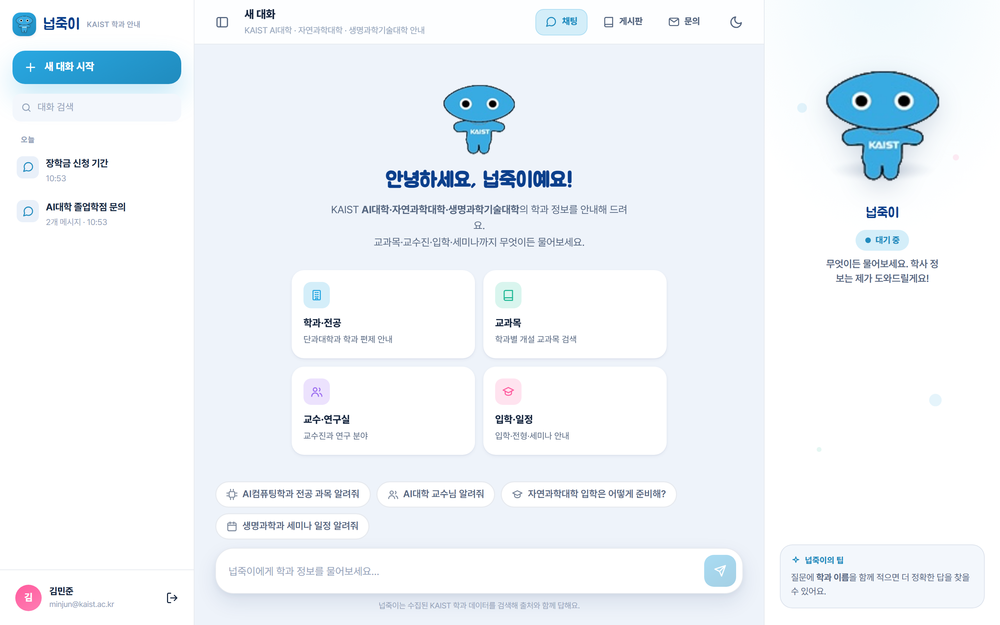
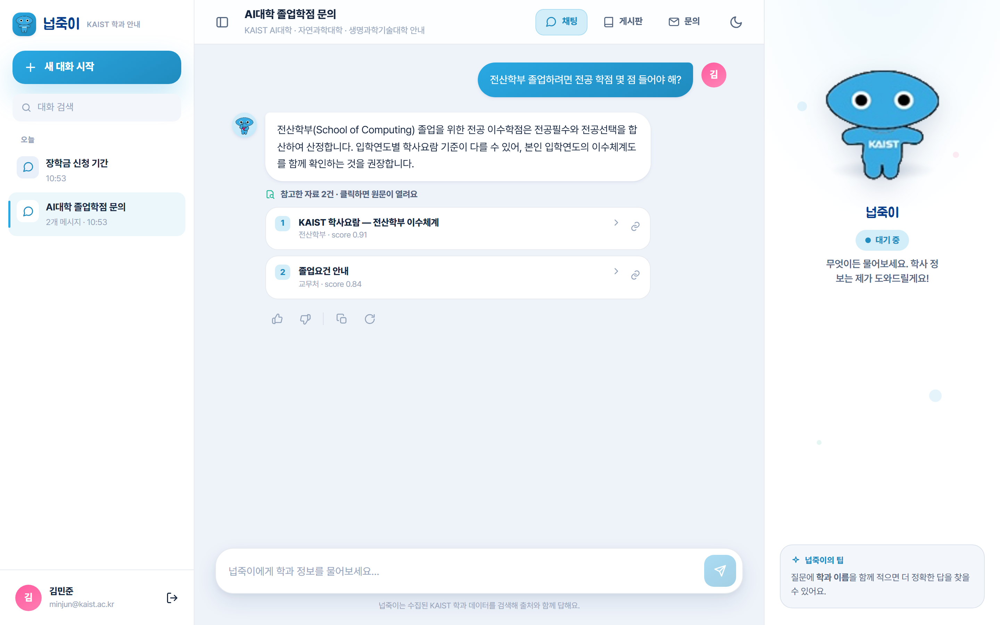
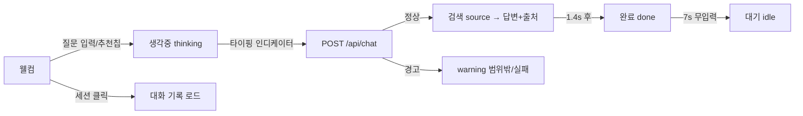

# 화면설계서 — 채팅 (메인 기능)

> 넙죽이와의 대화형 학사 안내. 자연어 질문 → 하이브리드 검색 → **출처 포함 답변**. 서비스의 핵심 화면.

| 항목 | 내용 |
|---|---|
| 라우트 | `/chat/` (SPA, 로그인 시 진입 / 게스트는 로그인 유도) |
| 화면 구성 | 세션 레일 · 대화 스레드 · 입력창 · 넙죽이 마스코트 패널 |
| 접근 권한 | 로그인 사용자 (대화 기록 저장) |
| 연동 API | `/api/chat/`, `/api/chat/sessions/`, `/api/chat/sessions/<id>/` |

---

## 1. 실제 구현 화면

| 채팅 메인 (웰컴) | 답변 + 출처 카드 |
|:---:|:---:|
|  |  |

---

## 2. 화면 레이아웃 (와이어프레임)

    +----------------+--------------------------------------+-------------------+
    | 세션 레일      |  [≡] 대화 제목   [채팅·게시판·문의][관리자][테마] |  넙죽이 패널 |
    | [+ 새 대화 시작]|  KAIST AI대학·자연과학·생명과학기술대 안내 |  (마스코트)      |
    | [대화 검색]    |--------------------------------------|   상태칩         |
    | 오늘           |   사용자 말풍선 (오른쪽)             |   대기/생각중/   |
    |  · 세션 제목   |                                      |   검색/완료/경고 |
    | 어제           |   넙죽이 답변 (왼쪽)                 |                  |
    |  · 세션 제목   |    - 본문 (LLM 생성, 마크다운→HTML)  |   넙죽이 한마디  |
    |  ...           |    - 참고한 자료 N건 (출처 카드)     |                  |
    |                |    - 👍 👎 | 복사 다시생성          |   넙죽이의 팁    |
    |                |--------------------------------------|                  |
    | [사용자카드/   |  추천 칩 ···                         |                  |
    |  로그아웃]     |  [입력창 ......................][전송]|                  |
    |                |  넙죽이는 수집된 데이터를 검색해 답해요|                  |
    +----------------+--------------------------------------+-------------------+

---

## 3. 화면 구성 요소

| 영역 | 구성 요소 | 설명 / 동작 |
|---|---|---|
| 세션 레일 | `새 대화 시작` | 활성 세션 해제 + 웰컴 화면 |
| 세션 레일 | `대화 검색` | 세션 제목 클라이언트 필터 |
| 세션 레일 | 세션 목록 | 날짜별 그룹(오늘/어제…), 클릭 시 대화 로드, 활성 표시 |
| 세션 레일 | 사용자 카드 | 이니셜·이름·이메일, 클릭 시 로그아웃 |
| 헤더 | 사이드바 토글 | 레일 접기/펼치기 (상태 저장) |
| 헤더 | 대화 제목·부제 | 현재 세션 제목 / 안내 학과 범위 |
| 헤더 | 상단 내비 | 채팅 · 게시판 · 문의 전환 |
| 헤더 | `관리자` 버튼 | `role==='admin'` 일 때만 노출 → 통계 화면 |
| 헤더 | 테마 토글 | 라이트/다크 전환 |
| 스레드 | 웰컴 | 마스코트·환영문구·추천 카드(WELCOME_CARDS)·추천 칩 |
| 스레드 | 사용자 말풍선 | 이니셜 아바타 + 질문 |
| 스레드 | 넙죽이 답변 | 마스코트 아바타 + 답변 + 출처 + 피드백 |
| 입력 | 추천 칩 | 클릭 시 해당 질문 전송 |
| 입력 | 입력창(textarea) | 자동 높이(최대 140px), `Enter` 전송 / `Shift+Enter` 줄바꿈 |
| 입력 | 전송 버튼 | 빈 입력·응답 중 비활성 |
| 우측 | 넙죽이 패널 | 마스코트 + 상태칩 + 한마디 + 팁 |

---

## 4. 답변 메시지 구성

| 요소 | 설명 |
|---|---|
| 답변 본문 | LLM 텍스트를 안전 HTML로 변환 — `#` 헤더 제거, `**굵게**`, 불릿 리스트, 과목코드(예: `CS200`) 강조 |
| 출처 카드 | "참고한 자료 N건 · 클릭하면 원문이 열려요" — 번호·제목·`학과 · score`·원문 링크(새 탭) |
| 피드백 바 | 👍 도움됨 / 👎 아쉬움 / 복사 / 다시 생성 |

> 👍/👎·복사·다시생성은 현재 **클라이언트 UI 반응**(마스코트 멘트·안내 문구)으로 동작합니다. 서버 피드백 적재는 확장 예정.

---

## 5. 사용자 흐름 · 마스코트 상태

| 상태 | 마스코트 | 트리거 |
|---|---|---|
| 대기 | `idle` | 초기·무입력 |
| 생각중 | `thinking` | 질문 전송 직후(타이핑 점 표시) |
| 검색 | `source` | 응답 도착, 출처 노출 |
| 완료 | `done` | 출처 확인 후 |
| 경고 | `warning` | 범위 밖·검색 실패·응답 오류(폴백 안내) |

---

## 6. 상태 · 예외 처리

| 상황 | 처리 |
|---|---|
| 응답 대기 | 타이핑 인디케이터(점 3개) + 마스코트 `thinking` |
| 범위 밖 질문 | `warning` 답변 + 추천 칩으로 재질문 유도 |
| API 오류 | 로컬 폴백 검색(`localFallback`)으로 답변 시도, 실패 시 안내 |
| 대화 로드 실패 | 마스코트 `warning` "대화를 불러오지 못했어요" |
| 빈 입력 | 전송 버튼 비활성 |

---

## 7. 연동 API

| 메서드 | 경로 | 용도 |
|---|---|---|
| POST | `/api/chat/` | `{session_id, question}` → `{answer, sources, warning, route, session_id}` |
| GET | `/api/chat/sessions/` | 세션 목록(레일) |
| GET | `/api/chat/sessions/<id>/` | 세션 + 메시지 기록 |
| POST | `/api/auth/logout/` | 로그아웃 → 로그인 화면 |
