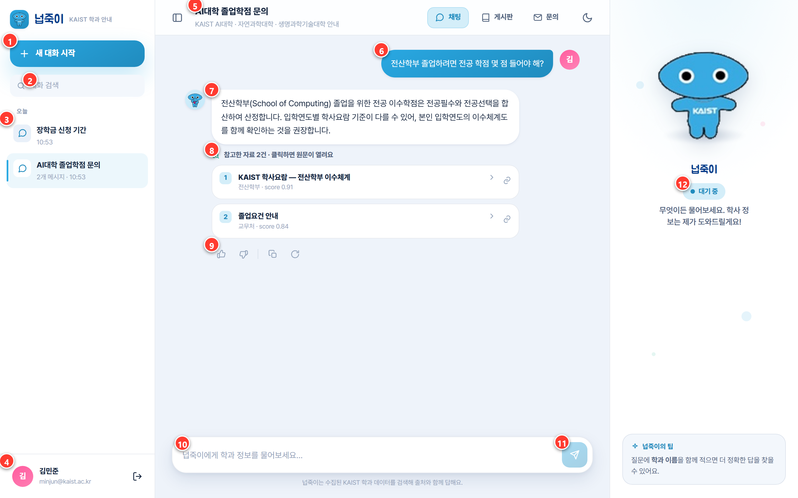
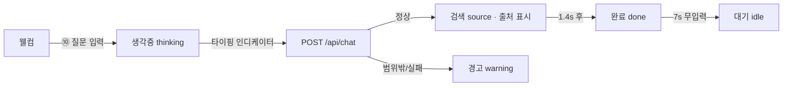

# 화면설계서 — 채팅 (메인 기능)

> 넙죽이와의 대화형 학사 안내. 자연어 질문 → 하이브리드 검색 → **출처 포함 답변**. 서비스의 핵심 화면.

| 라우트 | 접근 | 화면 구성 | 연동 API |
|---|---|---|---|
| `/chat/` | 로그인 | 세션 레일 · 대화 스레드 · 입력창 · 마스코트 패널 | `/api/chat/`·`sessions/`·`sessions/<id>/` |

---

## 1. 채팅 화면 (대화 + 출처)

| 번호 | 화면 요소 | 설명 / 동작 |
|:--:|---|---|
| ① | 새 대화 시작 | 활성 세션 해제 + 웰컴 화면으로 초기화 |
| ② | 대화 검색 | 세션 제목 클라이언트 필터 |
| ③ | 세션 목록 | 날짜별 그룹(오늘/어제…), 클릭 시 대화 기록 로드, 활성 표시 |
| ④ | 사용자 카드 | 이니셜·이름·이메일, 클릭 시 로그아웃 |
| ⑤ | 대화 제목·부제 | 현재 세션 제목 / 안내 범위(AI대학·자연과학·생명과학기술대) |
| ⑥ | 사용자 말풍선 | 오른쪽 정렬, 사용자 질문 |
| ⑦ | 넙죽이 답변 | LLM 생성 답변(마크다운→안전 HTML: 굵게·불릿·과목코드 강조) |
| ⑧ | 출처 카드 | "참고한 자료 N건" — 학과·score·원문 링크(클릭 시 새 탭) |
| ⑨ | 피드백 바 | 👍 도움됨 / 👎 아쉬움 / 복사 / 다시 생성 |
| ⑩ | 입력창 | 자동 높이(최대 140px), `Enter` 전송 / `Shift+Enter` 줄바꿈 |
| ⑪ | 전송 버튼 | 빈 입력·응답 중 비활성 |
| ⑫ | 마스코트 상태칩 | 대기/생각중/검색/완료/경고 상태 표시 + 한마디 |

---

## 2. 마스코트 상태 흐름

질문 전송 시 마스코트가 진행 상태를 시각적으로 표현합니다.

| 상태 | 트리거 |
|---|---|
| 대기 `idle` | 초기·무입력 |
| 생각중 `thinking` | 질문 전송 직후(점 3개 표시) |
| 검색 `source` | 응답 도착, 출처 노출 |
| 완료 `done` | 출처 확인 후 |
| 경고 `warning` | 범위 밖·검색 실패·응답 오류(폴백 안내) |

> ⑨ 피드백(👍👎)·복사·다시생성은 현재 클라이언트 UI 반응으로 동작하며, 서버 피드백 적재는 확장 예정입니다.
