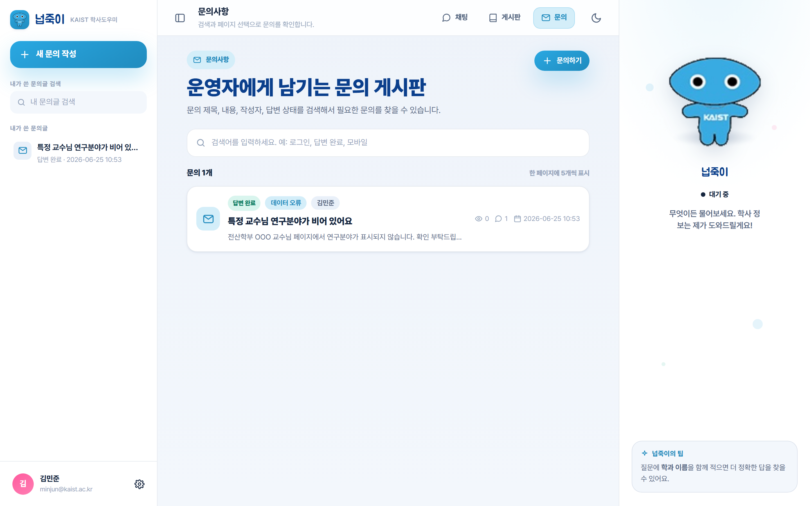
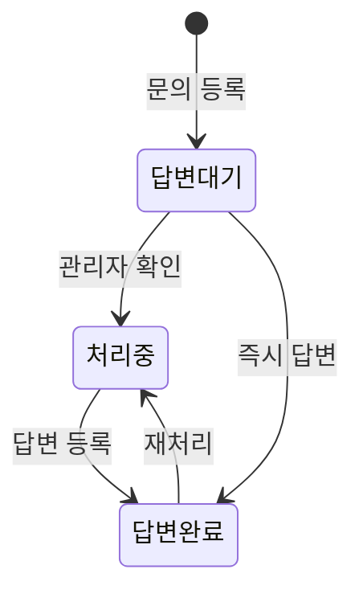

# 화면설계서 — 문의사항 (커뮤니티)

> 운영자에게 직접 남기는 1:1 문의 게시판. 계정·데이터·답변 품질 등 서비스 운영 이슈를 접수하고 답변 상태를 관리.

| 항목 | 내용 |
|---|---|
| 라우트 | `/inquiry/` (SPA, `window.__ROUTE="inquiry"`) |
| 화면 구성 | 목록 · 문의 상세 · 문의 작성/수정 (단일 SPA 내 전환) |
| 접근 권한 | 작성: 로그인 / 비공개 문의 열람: 작성자·관리자 / 상태 변경·답변: 관리자 |
| 연동 API | `/api/community/inquiries/`, `/inquiries/<id>/`, `/inquiries/<id>/comments/`, `/inquiries/<id>/status/` |

---

## 1. 실제 구현 화면

---

## 2. 화면 레이아웃 (와이어프레임)

    +----------------+--------------------------------------+-------------------+
    | 좌측 레일      |  [문의사항] 운영자에게 남기는 문의 게시판 |  넙죽이 패널       |
    | [+ 새 문의 작성]|  제목·내용·작성자·답변 상태로 검색      |  (마스코트)        |
    | 내 문의 검색   |  [검색어... 예: 로그인, 답변 완료]     |   상태칩           |
    | [내 문의글 검색]|--------------------------------------|                   |
    | 내가 쓴 문의글 |  문의 N개          한 페이지에 5개 표시 |   넙죽이의 팁     |
    |  · 문의 제목 … |  +--------------------------------+   |                   |
    |  · 문의 제목 … |  |[답변 대기] 유형  작성자        |   |  계정·데이터·답변 |
    | (로그인 필요)  |  | 제목 ........................  |   |  품질 문의는      |
    |                |  | 요약 한 줄 ..................  |   |  유형을 골라      |
    |                |  | 조회 n · 댓글 n · 작성일       |   |  적어주세요.       |
    |                |  +--------------------------------+   |                   |
    |                |  |[답변 완료] 유형  제목 …        |   |                   |
    |                |  +--------------------------------+   |                   |
    |                |  [«  ‹  1  2  3  ›  »]  (페이지)      |                   |
    | [사용자/로그아웃]|                                      |                   |
    +----------------+--------------------------------------+-------------------+

---

## 3. 화면 구성 요소

| 영역 | 구성 요소 | 설명 / 동작 |
|---|---|---|
| 좌측 레일 | `새 문의 작성` 버튼 | 문의 작성 화면 진입 |
| 좌측 레일 | `내 문의글 검색` | 본인 문의 제목 필터 |
| 좌측 레일 | `내가 쓴 문의글` | 본인 문의 바로가기 (게스트: "로그인 후 확인") |
| 헤더 | 키커·제목·설명 | "문의사항 / 운영자에게 남기는 문의 게시판" |
| 툴바 | 검색창 | 제목·내용·작성자·답변 상태 검색 |
| 툴바 | `문의하기` 버튼 | 문의 작성 진입 |
| 목록 | 문의 행 | 상태칩 · 유형 뱃지 · 작성자 · 제목 · 요약 · 조회/댓글/작성일 |
| 목록 | 상태칩 | 답변 대기 / 처리중 / 답변 완료 (색상 구분) |
| 페이지네이션 | `« ‹ 1 2 3 › »` | 5개 단위 |
| 빈 상태 | "문의글이 없습니다" | 첫 문의 작성 또는 다른 검색어 안내 |

---

## 4. 문의 작성 / 수정 폼

    +----------------------------------------+
    | [← 목록으로]  문의 글쓰기  [문의 등록]  |
    |----------------------------------------|
    | 문의 유형 [계정 및 로그인 ▼]           |
    | 제목      [..............................] |
    | 문의 내용 [.............................. |
    |            (10줄 textarea)              |
    |            ..............................] |
    | ☑ 비공개 문의                          |
    +----------------------------------------+

| 필드 | 타입 | 필수 | 제약 | 비고 |
|---|---|---|---|---|
| 문의 유형 | select | ✅ | 계정 및 로그인·데이터 오류·답변 품질·게시판 기능·기타 | — |
| 제목 | text | ✅ | 최대 160자 | "제목을 입력해 주세요" |
| 문의 내용 | textarea(10행) | ✅ | — | placeholder: 오류 상황·기대 동작·재현 순서 |
| 비공개 문의 | checkbox | ❌ | **기본 체크(on)** | `is_private`, 작성자·관리자만 열람 |

> 서버측 검증(`_validate_inquiry_payload`): 유형·제목·내용 누락 시 `400`. `email_on_answer`는 현재 항상 false(이메일 알림 비활성).

---

## 5. 문의 상세

| 영역 | 구성 요소 | 설명 |
|---|---|---|
| 헤더 | `목록으로` / `수정`·`삭제` | 삭제·수정은 작성자(`canManage`) |
| 본문 | 상태칩 · 유형 뱃지 · 비공개 뱃지 | 현재 처리 상태 표시 |
| 본문 | **상태 변경 select** | 관리자(`canChangeStatus`)에게만: 대기/처리중/완료 전환 |
| 본문 | 작성자 카드 | 이니셜 아바타 · 이름 · 조회/댓글/작성일 |
| 답변 | "답변 및 댓글 N개" | 운영자 답변(댓글)을 시간순 표시 |
| 답변 | 입력창 | 로그인 시 답변/댓글 작성 |

---

## 6. 답변 상태 흐름

| 상태 | 값 | 의미 |
|---|---|---|
| 답변 대기 | `wait` | 접수, 미확인 |
| 처리중 | `progress` | 운영자 확인·처리 중 |
| 답변 완료 | `done` | 답변 등록 완료 |

---

## 7. 비공개 · 권한별 차이

| 기능 | 게스트 | 작성자 | 다른 사용자 | 관리자 |
|---|:---:|:---:|:---:|:---:|
| 목록 열람 | ✅ | ✅ | ✅ | ✅ |
| 비공개 문의 내용 열람 | ❌ | ✅(본인) | ❌ | ✅ |
| 문의 작성 | ❌ | ✅ | ✅ | ✅ |
| 본인 문의 수정/삭제 | ❌ | ✅ | ❌ | ✅ |
| 답변(댓글) 작성 | ❌ | ✅ | ✅ | ✅ |
| 상태 변경 | ❌ | ❌ | ❌ | ✅ |

> 비공개 문의는 목록에 `비공개` 뱃지로 표시되며, 작성자·관리자 외에는 상세 내용 접근이 차단됩니다.

---

## 8. 상태 · 예외 처리

| 상황 | 처리 |
|---|---|
| 로딩 | "문의글을 불러오는 중입니다" 스켈레톤 |
| 빈 목록 | "문의글이 없습니다" + 작성/검색 유도 |
| 검증 실패 | 인라인 오류(400 문구) |
| 권한 없음 | 비공개 접근 차단, 상태/관리 버튼 미노출 |
| 네트워크 오류 | 오류 카드 + 재시도 |

---

## 9. 연동 API

| 메서드 | 경로 | 용도 |
|---|---|---|
| GET | `/api/community/inquiries/?q=&page=&page_size=` | 목록 |
| POST | `/api/community/inquiries/` | 문의 작성 |
| GET | `/api/community/inquiries/<id>/` | 상세 (비공개 권한 검사) |
| PATCH/DELETE | `/api/community/inquiries/<id>/` | 수정·삭제 |
| POST | `/api/community/inquiries/<id>/comments/` | 답변·댓글 |
| PATCH | `/api/community/inquiries/<id>/status/` | 상태 변경(관리자) |
| GET | `/api/community/mine/` | 내가 쓴 문의 |
