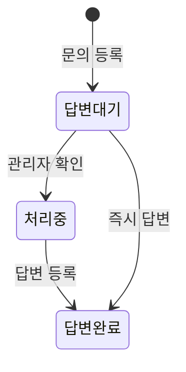

# 화면설계서 — 문의사항 (커뮤니티)

> 운영자에게 직접 남기는 1:1 문의 게시판. 계정·데이터·답변 품질 등 운영 이슈를 접수하고 답변 상태를 관리.

| 라우트 | 접근 | 화면 구성 | 연동 API |
|---|---|---|---|
| `/inquiry/` | 작성: 로그인 / 비공개: 작성자·관리자 | 목록 · 상세 · 작성 | `/api/community/inquiries/`·`/<id>/`·`/<id>/comments/`·`/<id>/status/` |

---

## 1. 문의 목록

| 번호 | 화면 요소 | 설명 / 동작 |
|:--:|---|---|
| ① | 새 문의 작성(레일) | 문의 작성 화면 진입 |
| ② | 검색창 | 제목·내용·작성자·답변 상태 검색 |
| ③ | 문의하기 버튼 | 문의 작성 화면 진입 |
| ④ | 답변 상태칩 | 답변 대기 / 처리중 / 답변 완료 (색상 구분) |
| ⑤ | 문의 행 | 상태칩 · 유형 뱃지 · 작성자 · 제목 · 요약 · (비공개 시 🔒) |
| ⑥ | 마스코트 패널 | 상태칩·팁 (커뮤니티 공통) |

---

## 2. 문의 작성 폼 · 검증

| 필드 | 타입 | 필수 | 제약 |
|---|---|:--:|---|
| 문의 유형 | select | ✅ | 계정 및 로그인·데이터 오류·답변 품질·게시판 기능·기타 |
| 제목 | text | ✅ | 최대 160자 |
| 문의 내용 | textarea(10행) | ✅ | 오류 상황·기대 동작·재현 순서 |
| 비공개 문의 | checkbox | ❌ | **기본 체크(on)** — 작성자·관리자만 열람 |

> 상세 화면에서 관리자는 **상태 변경 셀렉트(대기/처리중/완료)** 와 **답변(댓글)** 작성이 가능합니다. (`canChangeStatus`)

---

## 3. 답변 상태 흐름

| 상태 | 값 | 의미 |
|---|---|---|
| 답변 대기 | `wait` | 접수, 미확인 |
| 처리중 | `progress` | 운영자 확인·처리 중 |
| 답변 완료 | `done` | 답변 등록 완료 |

## 4. 비공개 · 권한별 차이

| 기능 | 게스트 | 작성자 | 다른 사용자 | 관리자 |
|---|:--:|:--:|:--:|:--:|
| 목록 열람 | ✅ | ✅ | ✅ | ✅ |
| 비공개 내용 열람 | ❌ | ✅(본인) | ❌ | ✅ |
| 문의 작성 / 답변 | ❌ | ✅ | ✅ | ✅ |
| 상태 변경 | ❌ | ❌ | ❌ | ✅ |
