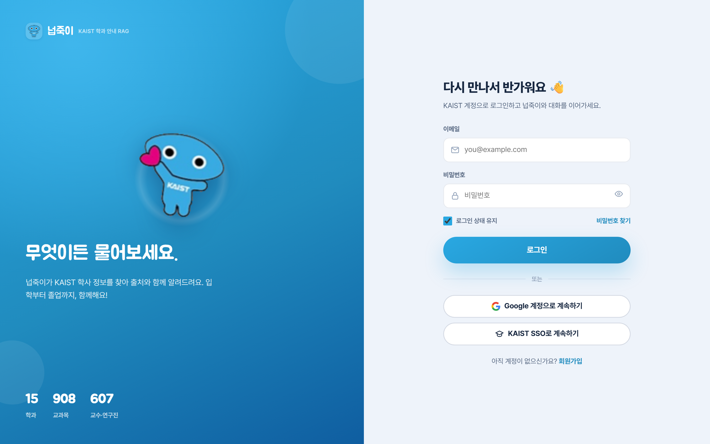
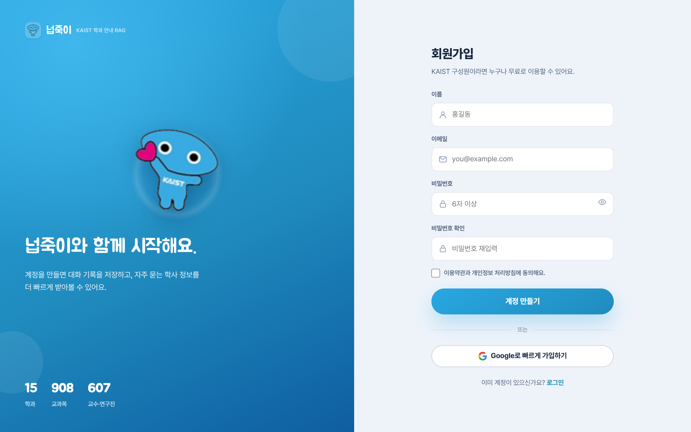
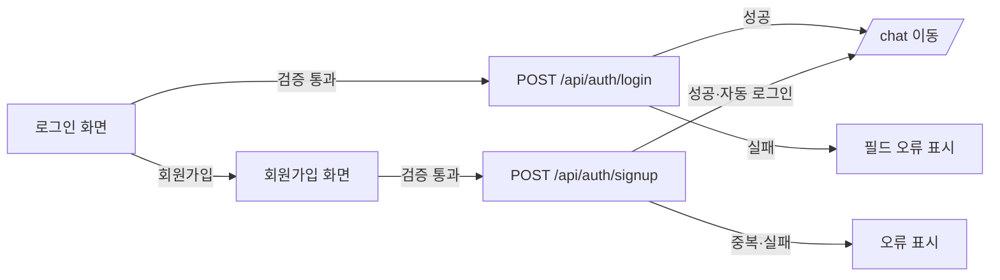

# 화면설계서 — 로그인 / 회원가입

> KAIST 계정 기반 인증 진입 화면. 좌측 브랜드 히어로 + 우측 입력 카드의 2단 구성.

| 항목 | 내용 |
|---|---|
| 라우트 | `/login/`, `/signup/` (공개) |
| 화면 구성 | 히어로(마스코트·실데이터 통계) + 인증 카드 |
| 인증 방식 | 이메일/비밀번호 (세션 기반) · Google/SSO는 시연용 비동작 |
| 연동 API | `/api/auth/login/`, `/api/auth/signup/`, `/api/auth/me/`, `/api/auth/logout/` |

---

## 1. 실제 구현 화면

| 로그인 | 회원가입 |
|:---:|:---:|
|  |  |

---

## 2. 화면 레이아웃 (와이어프레임)

    +---------------------------+----------------------------+
    |  히어로 (KAIST 블루)       |   인증 카드               |
    |   넙죽이 마스코트          |    이메일 [...........]    |
    |   "무엇이든 물어보세요"    |    비밀번호 [.........][눈] |
    |                           |    [로그인 상태 유지] 찾기 |
    |   학과 15 · 교과목 908 ·   |    [      로그인       ]   |
    |   교수·연구진 607          |    --- 또는 ---            |
    |   (실데이터 집계)          |    [G  Google 계정으로]    |
    |                           |    [   KAIST SSO (데모)  ] |
    |                           |    회원가입 →             |
    +---------------------------+----------------------------+

---

## 3. 화면 구성 요소

| 영역 | 구성 요소 | 설명 |
|---|---|---|
| 히어로 | 브랜드·마스코트 | "넙죽이 · KAIST 학과 안내 RAG" |
| 히어로 | 타이틀·설명 | 로그인/회원가입 별 카피 |
| 히어로 | 실데이터 통계 | 학과·교과목·교수·연구진 수 (`kbStats()` 집계) |
| 카드(로그인) | 이메일·비밀번호 | 비밀번호 표시 토글(눈 아이콘) |
| 카드(로그인) | 로그인 상태 유지 | 체크박스(기본 on) → remember |
| 카드(로그인) | 비밀번호 찾기 | 링크(시연용) |
| 카드(로그인) | 로그인 버튼 | 제출 시 busy "로그인 중…" |
| 카드(로그인) | Google / KAIST SSO | **시연용 비동작** ("아직 준비 중이에요") |
| 카드(회원가입) | 이름·이메일·비밀번호·확인 | 4개 필드 |
| 카드(회원가입) | 약관 동의 | 체크박스(필수) |
| 카드(회원가입) | 계정 만들기 | 제출 시 busy "계정 생성 중…" |
| 공통 | 화면 전환 링크 | 로그인 ↔ 회원가입 |

---

## 4. 입력 검증 규칙

### 로그인
| 필드 | 규칙 | 실패 메시지 |
|---|---|---|
| 이메일 | `\S+@\S+\.\S+` 형식 | "올바른 이메일을 입력해 주세요." |
| 비밀번호 | 6자 이상 | "비밀번호는 6자 이상이에요." |
| 인증 실패 | 서버 응답 | "로그인에 실패했어요." (서버 메시지 우선) |

### 회원가입
| 필드 | 규칙 | 실패 메시지 |
|---|---|---|
| 이름 | 필수 | "이름을 입력해 주세요." |
| 이메일 | 형식 검증 + 서버 중복 검사 | "올바른 이메일을…" / "이미 가입된 이메일입니다." |
| 비밀번호 | 6자 이상(서버 정책 동일) | "비밀번호는 6자 이상이에요." |
| 비밀번호 확인 | 비밀번호와 일치 | "비밀번호가 일치하지 않아요." |
| 약관 동의 | 체크 필수 | 라벨 강조(미동의 시 제출 차단) |

> 클라이언트 검증 통과 후 서버(`accounts.views`)에서 이메일 형식·중복·Django 비밀번호 정책을 재검증합니다.

---

## 5. 사용자 흐름

- 로그인/회원가입 성공 시 세션 생성 → `/chat/`으로 이동(`window.location.replace`)
- 회원가입은 성공 즉시 자동 로그인됨

---

## 6. 상태 · 예외 처리

| 상황 | 처리 |
|---|---|
| 검증 실패 | 해당 필드 `invalid` 강조 + `.err` 메시지 |
| 제출 중 | 버튼 비활성 + "로그인 중…/계정 생성 중…" |
| 서버 오류 | 응답 메시지를 필드 오류로 표시 |
| Google/SSO | 의도적 비동작 — 버튼 일시 "아직 준비 중이에요" 후 복원 |

---

## 7. 연동 API

| 메서드 | 경로 | 용도 |
|---|---|---|
| POST | `/api/auth/login/` | 로그인(email, password, remember) |
| POST | `/api/auth/signup/` | 회원가입(name, email, password) + 자동 로그인 |
| GET | `/api/auth/me/` | 현재 사용자/게스트 상태 |
| POST | `/api/auth/logout/` | 로그아웃 |
