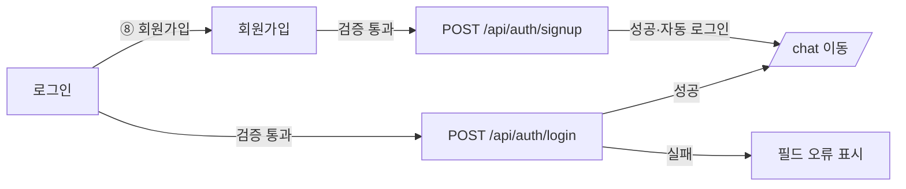

# 화면설계서 — 로그인 / 회원가입

> KAIST 계정 기반 인증 진입 화면. 좌측 브랜드 히어로 + 우측 입력 카드의 2단 구성.

| 라우트 | 접근 | 인증 방식 | 연동 API |
|---|---|---|---|
| `/login/`, `/signup/` | 공개 | 이메일/비밀번호 (세션) | `/api/auth/login`·`signup`·`me`·`logout` |

---

## 1. 로그인 화면

| 번호 | 화면 요소 | 설명 / 동작 |
|:--:|---|---|
| ① | 이메일 입력 | `\S+@\S+\.\S+` 형식 검증, 미충족 시 "올바른 이메일을 입력해 주세요." |
| ② | 비밀번호 입력 | 6자 이상, 미충족 시 "비밀번호는 6자 이상이에요." |
| ③ | 비밀번호 표시 토글 | 눈 아이콘 클릭 시 입력 값 표시/숨김 전환 |
| ④ | 로그인 상태 유지 | 체크박스(기본 on) → 세션 유지(remember) |
| ⑤ | 로그인 버튼 | 검증 통과 시 `POST /api/auth/login` → 성공 시 `/chat/` 이동, 제출 중 "로그인 중…" |
| ⑥ | Google 계정으로 계속하기 | **시연용 비동작** — "아직 준비 중이에요" 후 복원 |
| ⑦ | KAIST SSO로 계속하기 | **시연용 비동작** (OAuth 미연동) |
| ⑧ | 회원가입 링크 | 회원가입 화면으로 전환 |
| ⑨ | 실데이터 통계 | 학과·교과목·교수·연구진 수 (`kbStats()` 실시간 집계) |

---

## 2. 회원가입 화면

| 번호 | 화면 요소 | 설명 / 동작 |
|:--:|---|---|
| ① | 이름 입력 | 필수, 미입력 시 "이름을 입력해 주세요." |
| ② | 이메일 입력 | 형식 검증 + 서버 중복 검사("이미 가입된 이메일입니다.") |
| ③ | 비밀번호 입력 | 6자 이상(서버 정책 동일), 표시 토글 제공 |
| ④ | 비밀번호 확인 | 비밀번호와 일치해야 함, 불일치 시 "비밀번호가 일치하지 않아요." |
| ⑤ | 약관 동의 | 체크 필수, 미동의 시 라벨 강조 + 제출 차단 |
| ⑥ | 계정 만들기 버튼 | `POST /api/auth/signup` → 성공 시 자동 로그인 후 `/chat/` 이동 |
| ⑦ | 로그인 링크 | 로그인 화면으로 전환 |

---

## 3. 사용자 흐름

> 클라이언트 검증 통과 후 서버(`accounts.views`)가 이메일 형식·중복·Django 비밀번호 정책을 재검증합니다.
