# KAIST AI대학 데이터 — ERD (개체-관계 다이어그램)

> 미리보기: VS Code에서 이 파일을 열고 `Ctrl+Shift+V` (Markdown Preview).
> Mermaid 미리보기 확장이 있으면 다이어그램이 그림으로 보입니다.

## 1. 관계도

```mermaid
erDiagram
    department  ||..o{  person       : "소속"
    department  ||..o{  course       : "개설"
    department  ||..o{  admission    : "안내"
    department  ||..o{  event        : "주최"
    department  ||..o{  asset        : "보유"
    department  ||..o{  attachment   : "첨부"
    department  ||..o{  track        : "운영"
    department  ||..o{  rag_document : "출처"
    department  ||..o{  rag_chunk    : "출처"

    course      ||--o{  course_track : "분류"
    track       ||--o{  course_track : "포함"

    rag_document ||..o{ rag_chunk    : "분할"

    department {
        varchar dept PK "학과 코드 (aic/ax/ai_systems/fx)"
        varchar dept_name "학과명 (한글, UQ 성격)"
    }
    person {
        varchar record_id PK "레코드 ID"
        varchar dept FK "학과 코드"
        varchar name "이름"
        varchar role_normalized "직책 (정규화)"
        varchar email "이메일"
        varchar research_area "연구분야"
    }
    course {
        varchar record_id PK "레코드 ID"
        varchar dept FK "학과 코드"
        varchar course_code "과목 코드 (IDX)"
        varchar course_name "과목명"
        varchar course_type "이수구분"
        varchar credit "학점"
    }
    track {
        int     track_id PK "트랙 ID (AUTO_INCREMENT)"
        varchar dept FK "학과 코드"
        varchar track_name "트랙명 (UQ: dept+track_name)"
    }
    course_track {
        varchar course_id PK,FK "과목 ID"
        int     track_id PK,FK "트랙 ID"
        varchar course_type "이수구분"
    }
    admission {
        varchar record_id PK "레코드 ID"
        varchar dept FK "학과 코드"
        varchar admission_type "입학 유형"
        varchar title "제목"
        text    content "내용"
        varchar schedule_date "일정 날짜"
    }
    event {
        varchar record_id PK "레코드 ID"
        varchar dept FK "학과 코드"
        varchar event_type "행사 유형"
        varchar title "제목"
        varchar event_date "행사 날짜"
    }
    asset {
        varchar record_id PK "레코드 ID"
        varchar dept FK "학과 코드"
        varchar asset_type "자원 유형 (image/external/email/phone)"
        varchar url "URL"
    }
    attachment {
        int     attachment_id PK "첨부 ID (AUTO_INCREMENT)"
        varchar dept FK "학과 코드"
        varchar filename "파일명"
        varchar url "URL"
        bigint  size "파일 크기 (바이트)"
    }
    rag_document {
        varchar doc_id PK "문서 ID"
        varchar dept FK "학과 코드"
        varchar source_type "출처 유형"
        int     chunk_count "청크 수"
    }
    rag_chunk {
        varchar chunk_id PK "청크 ID"
        varchar doc_id FK "문서 ID"
        varchar dept FK "학과 코드 (비정규화: doc_id→rag_document.dept와 중복, 조회 최적화)"
        text    chunk_text "청크 텍스트"
        varchar source_record_id "원본 레코드 ID (다형 참조, FK 미설정)"
    }
```

> `quality_report`(검산 지표)는 어떤 테이블과도 관계가 없는 **독립 테이블**이라 위 도표에서 제외했습니다.

---

## 2. 표기법 읽는 법 (SQLD 핵심)

### (a) 카디널리티 — 까마귀발(Crow's Foot)
선 끝 기호가 "몇 개와 연결되는가"를 뜻합니다.

| 기호 | 의미 |
|------|------|
| `||` | 정확히 1 (one and only one) |
| `o{` | 0개 이상 (zero or many) |

예) `department ||..o{ person` = **학과 1개**에 **교수 0명 이상** → 전형적인 **1:N**.

### (b) 실선 vs 점선 — 식별/비식별 관계 ⭐
SQLD에서 자주 묻는 구분입니다. 기준은 **"부모의 키가 자식의 기본키(PK)에 포함되는가"**.

| 선 | 관계 | 뜻 | 이 모델의 예 |
|----|------|-----|------|
| **실선** `--` | **식별 관계** | 부모 키가 자식 **PK의 일부** → 자식은 부모 없이는 식별 불가 | `course`/`track` → `course_track` (FK가 복합PK의 일부) |
| **점선** `..` | **비식별 관계** | 부모 키가 자식의 **일반 FK** (PK 아님) → 자식은 독립적으로 식별 가능 | `department` → `person` 등 대부분 |

`course_track`만 실선인 이유: `course_id`·`track_id`가 **그 자체로 기본키**라서, 부모(과목·트랙)가 사라지면 존재 의미가 없어요. 반면 `person`은 `record_id`라는 자기 PK가 있어 `dept`(FK)와 무관하게 식별돼서 점선입니다.

---

## 3. 이 모델이 보여주는 설계 개념 3가지

1. **정규화(3NF)** — 모든 CSV에 중복되던 `dept_name`을 `department` 한 곳으로 모으고, 나머지는 `dept`(FK)로 참조. → 이행적 종속 제거.

2. **M:N 해소** — 과목↔트랙의 다대다를 `course_track` **교차 엔터티 + 복합키**로 분해.
   (오지라퍼스 `tbl_order_menu`(주문↔메뉴)와 똑같은 패턴)

3. **자연키 vs 인조키** — 크롤링이 만든 유일 ID가 있으면 그대로 PK(자연키: `record_id`, `doc_id`), 없으면 `AUTO_INCREMENT`로 새로 부여(인조키: `track_id`, `attachment_id`).

---

## 4. 테이블 한눈 요약

| 테이블 | PK | 주요 FK | 행수(예상) | 비고 |
|--------|----|---------|-----------|------|
| department | dept | — | 4 | 마스터 |
| person | record_id | dept | 246 | 교수/구성원 |
| course | record_id | dept | 109 | 교과목 |
| track | track_id | dept | 21 | 트랙 마스터(추출) |
| course_track | (course_id, track_id) | course, track | 109 | 교차 엔터티 |
| admission | record_id | dept | 74 | 입학 정보 |
| event | record_id | dept | 4 | 행사 |
| asset | record_id | dept | 270 | 링크/이미지 |
| attachment | attachment_id | dept | 4 | PDF 첨부 |
| rag_document | doc_id | dept | 482 | 문서 메타 |
| rag_chunk | chunk_id | doc_id, dept | 523 | 검색용 청크 |
| quality_report | — | — | 14 | 독립(검산) |
